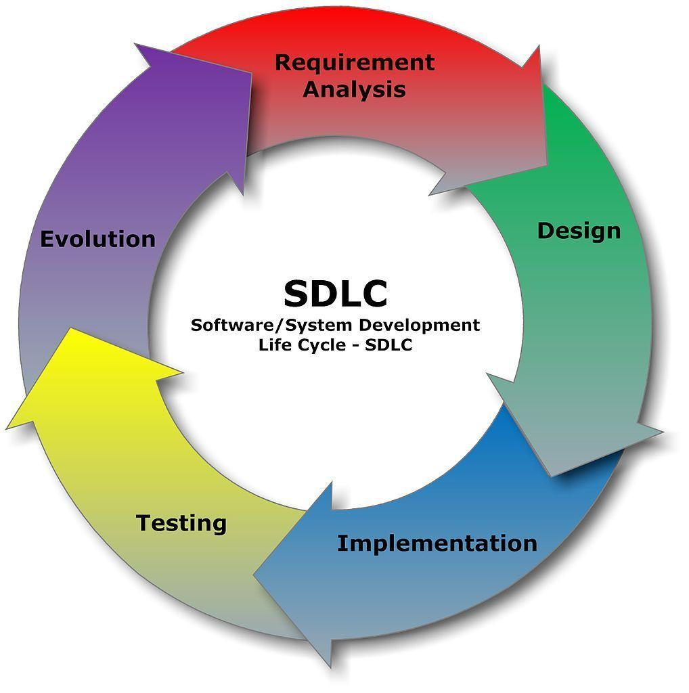

# DevOps-presentation-
DevOps 

# What is Devops? 

**Devops** is a set of practices that combines development and operations using a set of tools to automate processes and to ensure the highest quality software is delivered at a faster pace.

## What does the DevOps role entail 

- Continuous integration and continuous deployment
- Using Agile to collaborate with the team to make sure all systems are working properly and there are no failures
- Deploy programs in an efficient manner so that the user can instantly be able to use it with no issues
- Monitoring and reporting any errors which reduces their time to be detected
- To make sure that all code deployment is also secure so that there is no threat

## Benefits of DevOps

- Faster, better product delivery
- Greater automation
- Reduces time spent recovering when incidents occur
- Code is deployed 30x faster
- %50 reduced failure rate
- No cost of failure
- Financially more efficient 

## Tools used in Devops

 
 
### 1. *Version control tool : Git*

Git is perhaps the best and most widely used version control tool in development era characterized by dynamism and collaboration. 
Git DevOps tool is easy to implement as it is compatible with most protocols including HTTP, SSH, and FTP.

### 2. *Build tool: Maven*

**Maven** is one of the important DevOps tools for building projects. It is also designed to manage reporting, documentation, distribution, releases and dependencies processes. 

### 3. *Continuous integration tool: Jenkins*

**Jenkins** is an integration Devops tool. For continuous integration, Jenkins stands out as it is designed for both internal and plugin extensions. Jenkins is an open-source Java-based automation CI server that is supported by multiple operating systems including Windows, macOS, and other Unix OSs. Jenkins can be also deployed on cloud-based platforms.

## How does DevOps benefit a business? 

- The main benefit provided by DevOps strategies is the increased speed of deployment
- Devops culture ensures that the right thing is being delivered faster while still being cost-effective
- Tools like Lean are used to remove waste, tools like Agile are used to ensure that the right things are delivered quickly.
- The use of DevOps tools allow for significant improvements in the product quality
- Greater collaboration across business results in a better overall morale and chemistry. Barriers between teams are broken down through DevOps tools and culture

## DevOps and SDLC 

The traditional **SDLC** (systems development life cycle) would have 5 specialist teams working horizontally with one another, work is passed from one team to the next. 

In **DevOps** there will typically be four cross-functional teams which can deliver work to one another in a vertical manner, with each delivering and running an isolated component. 

