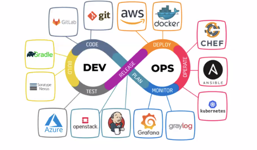

# DevOps-presentation-
DevOps 

# What is Devops? 

**Devops** is a set of practices that combines development and operations using a set of tools to automate processes and to ensure the highest quality software is delivered at a faster pace.

## What does the DevOps role entail 

- Continuous integration and continuous deployment
- Using Agile to collaborate with the team to make sure all systems are working properly and there are no failures
- Deploy programs in an efficient manner so that the user can instantly be able to use it with no issues
- Monitoring and reporting any errors which reduces their time to be detected
- To make sure that all code deployment is also secure so that there is no threat

## Benefits of DevOps

- Faster, better product delivery
- Greater automation
- Reduces time spent recovering when incidents occur
- Code is deployed 30x faster
- %50 reduced failure rate
- No cost of failure
- Financially more efficient 

## Tools used in Devops

 
 
### 1. *Version control tool : Git*

Git is perhaps the best and most widely used version control tool in development era characterized by dynamism and collaboration. 
Git DevOps tool is easy to implement as it is compatible with most protocols including HTTP, SSH, and FTP.

### 2. *Build tool: Maven*

**Maven** is one of the important DevOps tools for building projects. It is also designed to manage reporting, documentation, distribution, releases and dependencies processes. 

